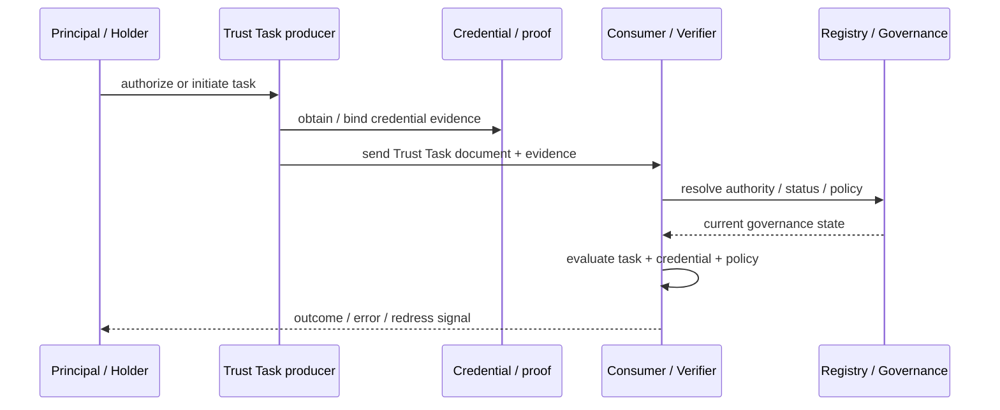

# Cross-specification pressure testing

RAHP can test not only a specification in isolation but also the **contract between specifications**. This matters when one document supplies a trust artefact and another supplies the execution semantics that consume it.

For the DTG Credential Specification and Trust Tasks, the high-level interaction is:



## The seam is a first-class test surface

A credential may be cryptographically valid while its issuer is no longer authoritative. A task may be correctly signed while its principal has changed intent. A `taskContext` may bind a credential to an exchange without proving that the exchange completed successfully. These are not necessarily defects in either component individually; they are **composition risks**.

The reference composed corpus is [`corpora/trust-tasks-credspec-composed.yaml`](../corpora/trust-tasks-credspec-composed.yaml).

## Review rule

For each composed scenario, reviewers should ask:

1. Which specification owns each semantic fact?
2. Which facts are evaluated at issuance, authorization, presentation and execution time?
3. Which dependencies can change between those moments?
4. Which party is responsible for re-evaluation?
5. What evidence survives for later audit or appeal?
6. Where does remediation belong: core spec, companion spec, governance, runtime, or operational policy?

## Coverage is directional

A cross-spec finding should identify whether the remediation belongs primarily to Trust Tasks, CredSpec, both, or an external governance/runtime layer. RAHP's `primary_disposition` remains the routing mechanism; the scenario corpus supplies the test condition, not the ownership decision.

## Manual GitHub Actions execution and WG review record

Cross-specification execution is **profile-owned, not DTG-owned**. RAHP core provides the generic workflow and validators; an ecosystem supplies its own registry, component adapters, composed corpora and reviewed assessment records. The DTG example pack declares its seams in [`profiles/dtg/cross-spec-tests.yaml`](../profiles/dtg/cross-spec-tests.yaml).

The manual **Run cross-specification pressure test** workflow accepts two explicit inputs: `registry_path` and `composition_id`. Nothing in the executor auto-loads DTG. A CAWG/C2PA deployment can therefore point at a CAWG-owned registry and run without evaluating, validating or publishing DTG compositions.

For operators focused on the bundled example portfolios, RAHP also exposes two thin convenience launchers:

- **Run DTG cross-specification pressure test** fixes the registry to `profiles/dtg/cross-spec-tests.yaml` and presents all eight runnable DTG compositions as a dropdown. Its default is `trust-tasks--credential-spec`.
- **Run CAWG/C2PA cross-specification pressure test** fixes the registry to `profiles/cawg/cross-spec-tests.yaml` and presents all five runnable CAWG/C2PA compositions as a dropdown. Its default is `c2pa--cawg-portfolio`.

These launchers contain no assessment logic. They call the generic workflow through `workflow_call`, passing only the selected composition and profile registry. `tools/validate_cross_spec_workflows.py` checks that each launcher's dropdown exactly matches the `runnable: true` entries in its registry, preventing UI and assurance-state drift. The generic workflow remains the extension point for any other ecosystem.

A composition is `runnable: true` only when its profile supplies a composed corpus and assessment record. `evidence_grade` distinguishes source-pinned/source-informed assessments from scenario-baseline assessments where upstream material is not yet sufficiently normative.

A manual workflow run:

1. validates the declared composition;
2. renders a detailed assessment record from the pinned RAHP evidence;
3. files or coalesces a durable issue in the RAHP Toolkit repository;
4. uploads the rendered review packet as a workflow artifact; and
5. exposes the resulting issue URL in the workflow summary.

The RAHP issue is the **WG circulation URL and evidence hub**. It contains an **Upstream issue candidates** section with one ready-to-triage block per open finding. Upstream filing is intentionally human-controlled: a WG or maintainer first confirms which specification owns the semantic contract, then files the relevant block upstream and links the upstream issue back to the RAHP review. This prevents an assurance tool from asserting normative ownership on behalf of an upstream project.

Repeated manual runs use a stable `<profile-id>:cross-spec:<composition-id>` assessment key. If the corresponding RAHP work item is still open, new triggers are coalesced into that issue rather than producing duplicate WG review URLs.

## v1.1 portable assurance mapping

Cross-spec reviews should map local findings to portable `RKP-*`, `CTP-*`, `GRP-*`, `ATP-*` and `EVP-*` patterns where a reusable mechanism exists. This does **not** replace deployment-specific risks or disposition; it makes the seam comparable across ecosystems.

The maintained worked assessment is [`examples/cross-spec/trust-tasks-credspec/pressure-test.yaml`](../examples/cross-spec/trust-tasks-credspec/pressure-test.yaml), with a generated readable view in its README. A combined synthesis also links this RAHP review to the existing composition security threat model.

A useful closure condition is therefore stronger than “both component specifications validate”: the composition should demonstrate semantic ownership, lifecycle alignment, authority continuity, privacy composition and contestability evidence at the seam.

## Adversarial false-independence evidence

Cross-specification assurance also needs to challenge evidence structures that look stronger merely because they contain more identities, actors, artifacts, hops or approvals. Issue [#193](https://github.com/sankarshanmukhopadhyay/rahp-toolkit/issues/193) established seven executable pressure-test records:

| Review | Threat surface | Preserved judgment |
|---|---|---|
| `SR-XSP-FI-001` | Sybil/common-control multiplicity | multiplicity is not evidence of independence |
| `SR-XSP-FI-002` | False governance diversity | nominal diversity is not governance independence |
| `SR-XSP-FI-003` | Trust laundering | provenance depth is not assurance depth |
| `SR-XSP-FI-004` | Sock puppetry | social/persona multiplicity is not social independence |
| `SR-XSP-FI-005` | Quorum capture | threshold arithmetic is not independent or legitimate approval |
| `SR-XSP-FI-006` | Collusion | distinct actors are not necessarily independent actors |
| `SR-XSP-FI-007` | Selective evidence | valid evidence is not necessarily complete evidence |

These records are pressure tests, not universal suspicion rules. Each preserves a legitimate counter-case: contextual identifiers, genuinely independent governance or corroboration, legitimate transformations, multi-persona use, independent threshold agreement, disclosed coalitions and proposition-scoped selective disclosure remain acceptable when the claimed assurance proposition is actually evidenced.

Unknown independence or completeness is not silently upgraded because a workflow succeeded or an artifact validated. The fixtures preserve bounded uncertainty / AMBER. Privacy-sensitive mechanisms for uniqueness, correlation, contradiction handling or completeness can cross the DPIP boundary when specialist privacy analysis is warranted; RAHP does not replace that examination with universal disclosure or universal correlation.

### Assurance ownership versus control-provider capability

False-independence assurance uses a generic routing boundary rather than assigning the threat to a particular cryptographic or ecosystem component:

```text
assurance proposition
  -> required control capability
  -> candidate provider class
  -> composed use
  -> residual assurance obligation
  -> RAHP verification
```

RAHP owns the assurance question and verifies the composed outcome. A companion component may provide a mechanism such as privacy-preserving contextual uniqueness. The composition owns applying that mechanism within its declared scope. Provider classes are non-normative: a ZKP mechanism, personhood/uniqueness credential, credential/authority system or another control can satisfy the bounded capability if its evidence supports the claim.

Mechanism success is deliberately narrower than assurance success. For example, a proof that establishes bounded-context non-reuse may prevent duplicate exercise without a universal correlator, but it does **not** by itself establish issuer independence, controller or governance independence, non-collusion, or evidentiary independence. Those remain separate propositions and must stay INDETERMINATE or otherwise bounded when evidence is unavailable.

This prevents both architectural errors: RAHP does not implement the cryptographic anti-Sybil mechanism itself, and it does not outsource the broader false-independence judgment to a ZKP result.

The corpus is guarded both by row-specific semantic tests and by `tests/test_false_independence_corpus_qualification.py`, which fails if a row disappears, loses stable identity, drops its adversarial/counter-case boundary, or silently turns unknown evidence into PASS/assured sufficiency.

## Profile isolation

RAHP treats ecosystem content as optional deployment packs:

```text
RAHP core
  tools/ + method/ + generic workflow
        │
        ├── profiles/dtg/   -> optional DTG registry and deployment metadata
        ├── profiles/cawg/  -> optional CAWG/C2PA deployment metadata
        └── profiles/<x>/   -> another ecosystem
```

The core workflow does not enumerate ecosystem IDs. Operators explicitly select a registry path. Profile-scoped assessment keys and labels prevent findings from different ecosystems from being coalesced together.

The DTG pack currently exposes eight runnable seams. VDS and Agent Names seams are marked `scenario-baseline` because their upstream repositories are currently too thin to support the same source evidence grade as mature specifications. They are executable assurance hypotheses, not normative conformance claims.
