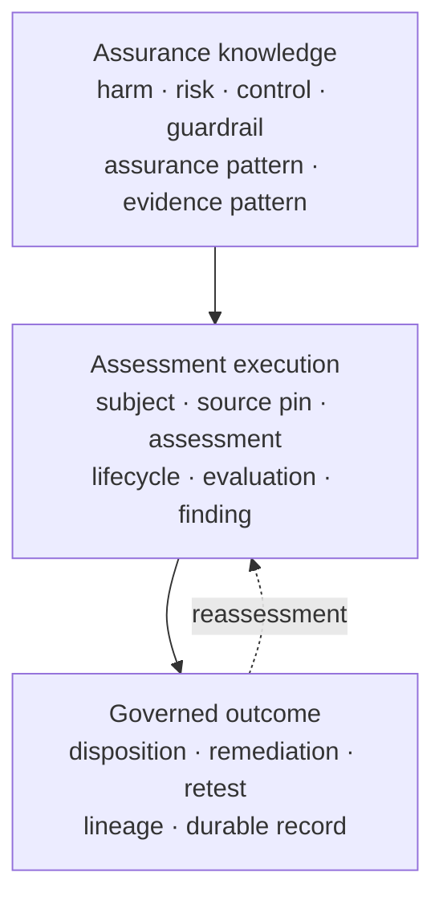
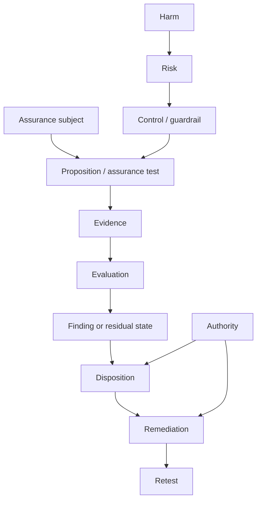

# RAHP data model

RAHP does not define one monolithic assessment object. Its data model is a set of linked, versioned records that preserve the distinction between the **assurance knowledge being reasoned about**, the **execution state of an assessment**, and the **evidence that justifies an outcome**.

This page is a reader-facing map. It introduces no new RAHP semantics. Where this page and a normative artifact differ, the normative artifact is authoritative.

## Where authority lives

For portable execution semantics, start with [`method/engine-contract.yaml`](../method/engine-contract.yaml). The current stable boundary is `rahp-engine-contract-v1`, revision `1.3`, with normalized result schema version `1`.

The authoritative machine-readable structures are the JSON Schemas under [`method/schema/`](../method/schema/). The engine contract identifies the schemas required at its portable execution boundary. [Engine contract](engine-contract.md) explains how contract-family, revision and result-schema versioning relate.

The method-level standards-development lifecycle is separately represented by [`method/lifecycle.yaml`](../method/lifecycle.yaml). It describes how assurance knowledge is developed across context/scoping, drafting, review/harmonisation, publication and maintenance. It is not the finite state machine for one assessment.

## Three connected model layers



### 1. Assurance knowledge

The portable assurance catalogue uses six reusable object families documented in [Assurance knowledge model](assurance-knowledge-model.md):

| Prefix | Object | Purpose |
|---|---|---|
| `HRM-*` | Harm pattern | Interest that can be harmed |
| `RKP-*` | Risk pattern | Reusable failure mechanism |
| `CTP-*` | Control pattern | Prevention, constraint, detection or remedy |
| `GRP-*` | Guardrail pattern | State the system must not silently enter |
| `ATP-*` | Assurance pattern | Proposition that can be tested |
| `EVP-*` | Evidence pattern | Evidence capable of supporting an assurance claim |

The catalogue schema is [`method/schema/catalogue.schema.json`](../method/schema/catalogue.schema.json). Deployment-specific findings and evidence remain deployment records; portable patterns do not substitute for local evidence, authority or disposition.

### 2. Assessment execution

The engine contract defines the portable execution chain:

```text
source → observation → trigger → assessment → evidence → evaluation
       → finding → disposition → remediation → retest → baseline
```

The finite lifecycle for an individual assessment is defined by [`assessment-lifecycle.schema.json`](../method/schema/assessment-lifecycle.schema.json):


The schema, not this diagram, is authoritative for valid states and transition records. A terminal lifecycle record carries one of the finite terminal outcomes allowed by that schema.

### 3. Governed assurance outcome

A normalized portable result is defined by [`rahp-result.schema.json`](../method/schema/rahp-result.schema.json). It binds assessment identity and target revision to findings, disposition and evidence, and can additionally carry evaluations, remediation and retest records.

The important boundary is semantic, not merely structural:

- an observation is not automatically an assessment;
- a detector signal is not automatically a finding;
- a finding is distinct from queue/work-item state;
- workflow success is operational evidence, not an assurance outcome;
- zero findings do not establish assurance when assurance gaps, review-required propositions or unassessed propositions remain.

These invariants are normative in [`method/engine-contract.yaml`](../method/engine-contract.yaml).

## Relationship view

RAHP also has an explicit portable graph representation in [`assurance-graph.schema.json`](../method/schema/assurance-graph.schema.json). It permits typed nodes including targets, components, compositions, requirements, evidence, risks, harms, controls, guardrails, assurance tests, assessments, findings, remediations and authorities, connected by typed edges such as `depends-on`, `governs`, `authorizes`, `supports`, `mitigates`, `tests`, `supersedes`, `remediates`, `requires`, `composes-with`, `produces` and `evaluated-by`.

A useful conceptual reading is:



This diagram is explanatory. The graph schema's enumerated node and edge types remain authoritative.

## Core record map

| Concern | Authoritative machine-readable surface | Reader guidance |
|---|---|---|
| Portable execution boundary | [`method/engine-contract.yaml`](../method/engine-contract.yaml) | [Engine contract](engine-contract.md) |
| Normalized result | [`rahp-result.schema.json`](../method/schema/rahp-result.schema.json) | [Interpreting results](interpreting-results.md) |
| Assessment lifecycle | [`assessment-lifecycle.schema.json`](../method/schema/assessment-lifecycle.schema.json) | [How RAHP works](how-rahp-works.md) |
| Assessment lineage | [`assessment-lineage.schema.json`](../method/schema/assessment-lineage.schema.json) | [Continuous assurance](continuous-assurance.md) |
| Assurance evaluation | [`assurance-evaluation.schema.json`](../method/schema/assurance-evaluation.schema.json) | [How RAHP works](how-rahp-works.md) |
| Normalized finding | [`normalized-finding.schema.json`](../method/schema/normalized-finding.schema.json) | [Interpreting results](interpreting-results.md) |
| Specialist result | [`assessor-result.schema.json`](../method/schema/assessor-result.schema.json) | [Engine contract](engine-contract.md) |
| Evidence provenance | [`evidence-manifest.schema.json`](../method/schema/evidence-manifest.schema.json) | [Review evidence and retention](evidence-retention.md) |
| Evidence freshness | [`assurance-freshness.schema.json`](../method/schema/assurance-freshness.schema.json) | [Continuous assurance](continuous-assurance.md) |
| Assurance graph | [`assurance-graph.schema.json`](../method/schema/assurance-graph.schema.json) | This page |
| Authority | [`authority.schema.json`](../method/schema/authority.schema.json) | [How RAHP works](how-rahp-works.md) |
| Delegation scope | [`delegation-scope.schema.json`](../method/schema/delegation-scope.schema.json) | Schema is authoritative |
| Remediation | [`remediation-manifest.schema.json`](../method/schema/remediation-manifest.schema.json) | [Engine contract](engine-contract.md) |
| Retest | [`retest.schema.json`](../method/schema/retest.schema.json) | [Engine contract](engine-contract.md) |
| Retention policy | [`method/evidence-retention.yaml`](../method/evidence-retention.yaml) | [Review evidence and retention](evidence-retention.md) |
| Method lifecycle | [`method/lifecycle.yaml`](../method/lifecycle.yaml) | Method lifecycle, not assessment FSM |

The schema directory contains additional specialized records. This table is an entry map, not an exhaustive schema inventory.

## Evidence, provenance and authority

Evidence is a first-class record rather than an untyped attachment. [`evidence-manifest.schema.json`](../method/schema/evidence-manifest.schema.json) records:

- evidence identity and type;
- source kind, locator and immutable revision;
- producing mechanism and optional actor/workflow;
- observation time and optional validity;
- integrity algorithm and digest;
- authority class and optional issuer/basis; and
- the proposition or record identifiers the evidence supports.

The evaluation model in [`assurance-evaluation.schema.json`](../method/schema/assurance-evaluation.schema.json) keeps signals, control evidence, assurance evidence and residual state distinct. Evidence assertions carry context and authority classification so that, for example, documentation or build infrastructure cannot silently acquire normative authority.

Retention is separately governed by [`method/evidence-retention.yaml`](../method/evidence-retention.yaml). [Review evidence and retention](evidence-retention.md) explains the operational rule: Git preserves assurance state, not execution exhaust.

## Identity, source pins and lineage

An assurance conclusion is bounded to the subject, scope and immutable source state against which it was established. The normalized result therefore identifies the assessment and reviewed revision. Reassessment and clean-room execution preserve explicit lineage rather than silently attaching a previous conclusion to a new source state.

Use [`assessment-lineage.schema.json`](../method/schema/assessment-lineage.schema.json) for the machine-readable lineage contract and [`assessment-lifecycle.schema.json`](../method/schema/assessment-lifecycle.schema.json) for current finite lifecycle state.

## Reading a serialized RAHP record

When inspecting an instance or generated result, read from identity toward conclusion:

```text
assessment identity
  ↓
target + immutable reviewed revision
  ↓
mode / lifecycle state
  ↓
propositions and evaluations
  ↓
evidence + provenance
  ↓
findings / residual state
  ↓
disposition
  ↓
remediation / retest where applicable
  ↓
lineage / next reassessment
```

Do not infer semantics from field names alone. Validate the record against the applicable schema and engine revision.

## Method lifecycle versus assessment lifecycle

RAHP deliberately has two different lifecycle concepts.

**Method lifecycle:** [`method/lifecycle.yaml`](../method/lifecycle.yaml) describes how assurance knowledge is developed through standards work. Its stages produce record types such as personas, risks, controls, guardrails, assurance tests, recommendations and conformance claims.

**Assessment lifecycle:** [`assessment-lifecycle.schema.json`](../method/schema/assessment-lifecycle.schema.json) describes the finite machine-owned state of a particular assessment.

The first answers **how assurance knowledge is developed and maintained**. The second answers **where a particular assessment is in its governed execution**.

## Implementation and conformance

Reference implementations may use richer internal structures, but portable behavior must preserve the normalized proposition, evidence, reasoning and lifecycle semantics required by the engine contract.

For implementation work, read in this order:

1. [How RAHP works](how-rahp-works.md)
2. [Assurance knowledge model](assurance-knowledge-model.md)
3. [This data-model map](data-model.md)
4. [Engine contract](engine-contract.md) and [`method/engine-contract.yaml`](../method/engine-contract.yaml)
5. the relevant [JSON Schemas](../method/schema/)
6. [Review evidence and retention](evidence-retention.md)
7. worked records under `examples/` and deployment-owned records under `instances/`
8. controller/reference implementation code only after the portable contracts are understood.

Conformance is established by the normative contracts, schemas and fixtures, not by reproducing one implementation's internal object layout.
