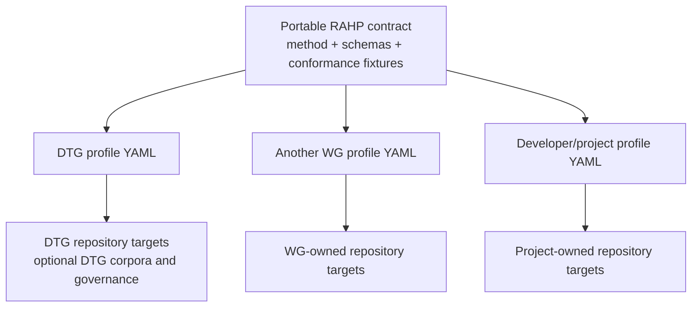

# Portability

RAHP is portable by construction: **the adopter supplies deployment configuration and owns deployment state; the method and engine contract remain shared**. v0.5 introduced the configuration boundary, v0.6 demonstrated it with DTG and CAWG/C2PA, v0.7 extended it to multi-source corpora and independent situational monitoring, and v0.8 makes the execution/result boundary language-neutral while separating ephemeral run state from durable assurance state.



## Machine-tested architectural invariant

`method/project-invariants.yaml` now makes portability an executable project invariant rather than a documentation convention.

**`INV-PORTABLE-001`** states that RAHP portable core must remain executable and conformant without any bundled deployment, profile, corpus or ecosystem-specific governance state. Deployment-specific material may consume portable RAHP contracts but must not become a dependency of them. The qualified distribution must also retain evidence that RAHP can assess specifications, protocols, implementations and composed systems across human-harm, governance, adversarial and resilience pressure dimensions.

CI executes:

```bash
python3 tools/validate_project_invariants.py
```

The validator checks the declared portable-core files for prohibited deployment dependencies, validates two materially different synthetic non-DTG deployments, checks the four target classes and four pressure dimensions, and performs a destructive portability test. That destructive test copies the repository to a temporary workspace, removes `profiles/`, `instances/`, `corpora/` and `examples/`, and then runs the portable portability qualification there.

The dependency direction is therefore explicit:

```text
profile / instance / corpus / example
                ↓
          portable RAHP core
                ↓
        stable RAHP contracts
```

The reverse dependency is a CI failure. A bundled ecosystem may demonstrate or extend RAHP; it may not become a prerequisite for the portable core.

## v0.5 portability contract

An adopter must be able to:

1. checkout RAHP without deleting or editing DTG exemplar material;
2. create one YAML file listing one or more repositories and their context;
3. validate the file against the portable RAHP configuration schema;
4. resolve target revisions with pinned commits, local Git checkouts, or configured remote branches;
5. select RAHP, security, or combined review mode per target;
6. scaffold assessment records without loading DTG corpora, DTG issues, DTG governance records, or the DTG Portfolio Monitor; and
7. retain full commit-level provenance for each assessment; and
8. keep ordinary execution exhaust outside Git while preserving compact durable dispositions and integrity-bound evidence references.

## Mechanical proof

Two deliberately non-DTG fixtures exercise materially different adoption shapes:

- `tests/fixtures/portable-project/rahp.yaml` — specification and protocol targets;
- `tests/fixtures/portable-implementation/rahp.yaml` — implementation targets.

CI runs:

```bash
python3 tools/validate_portability.py
```

Both fixtures must validate, list their targets, and resolve dry-run scaffolding through the same RAHP engine without DTG repositories, corpora, portfolio-monitor state, governance issues, or other bundled deployment dependencies. `tools/validate_project_invariants.py` repeats this proof after bundled deployment surfaces are physically absent from a temporary checkout.

Passing these tests proves **configuration, workflow and architectural portability**. A real external Working Group adoption remains valuable field evidence, but it is no longer required to make the software architecture portable.

## Deployment-specific extensions

An adopter may add integrations under `extensions`. The bundled DTG profile uses this mechanism to describe its Portfolio Monitor relationship. The core schema intentionally treats extension content as adopter-owned metadata: the RAHP engine does not require it.

## Instance-local assurance vocabulary

A portable deployment may maintain risks or other assessment vocabulary that belongs to that instance rather than to the bundled DTG exemplar. The CAWG/C2PA deployment demonstrates this with `instances/cawg/data/risks.yaml`: its `CRK-*` identifiers are RAHP assessment artefacts and are not CAWG, DIF, or C2PA normative identifiers. The renderer and pressure-test validator resolve instance-local records without importing them into the portable method or the DTG catalogue.

## Independent change tracking

Portability also applies to operational monitoring. `tools/instance_monitor.py` reads a static deployment profile, tracks each `repository@branch` revision, records material changes, and emits review events. `tools/publish_assessment_issues.py` can turn those events into deduplicated issues in the RAHP review repository. In this distribution, automated publication is a hard control-plane boundary: issues may be created only in `sankarshanmukhopadhyay/rahp-toolkit`; target and upstream repositories are metadata only. This keeps source monitoring and review workflow reusable without coupling an external deployment to the DTG Portfolio Monitor. A discovered or configured GitHub repository with no commit history is represented as `status: no-commits` and does not abort the wider monitoring run; other HTTP/API failures remain errors so operational faults are not silently hidden.

### Assessment identity and materiality

Repository monitoring is target-aware. Main-branch targets retain the portable `instance:repository:owner/repo` assessment key, while non-main branches use `instance:repository:owner/repo@branch` so experimental or governance branches cannot coalesce into the same assurance work item.

Materiality is also role-aware. A deployment may add `assessment.materiality.role_profiles` keyed by the target `context.type`. This lets a normative specification emphasize specification/schema surfaces while a reference implementation treats implementation code and tests as assurance-relevant evidence. Target-specific `scope.include` entries and deployment-wide `always_material_paths` remain additive.

Deployments may also configure `assessment.materiality.documentation_paths` together with `documentation_triage_roles`. When every matched material path is documentation/routing material and the target role is explicitly triage-enabled, the portable monitor emits a `change-triage` event rather than an `assessment-required` event. This is intentionally opt-in: specifications whose Markdown files are normative remain assessment-sensitive unless the deployment explicitly classifies their role otherwise.

`tools/issue_watch.py` provides an independent **allow-listed issue early-warning channel**. A deployment owns its issue registry, labels, state and affected-review mapping. The toolkit does not discover or ingest every issue automatically, and issue text never becomes normative evidence merely because it is watched. CAWG/C2PA and DTG both use this mechanism with separate registries, demonstrating that situational monitoring is part of the portable operational layer rather than a CAWG-specific feature.
