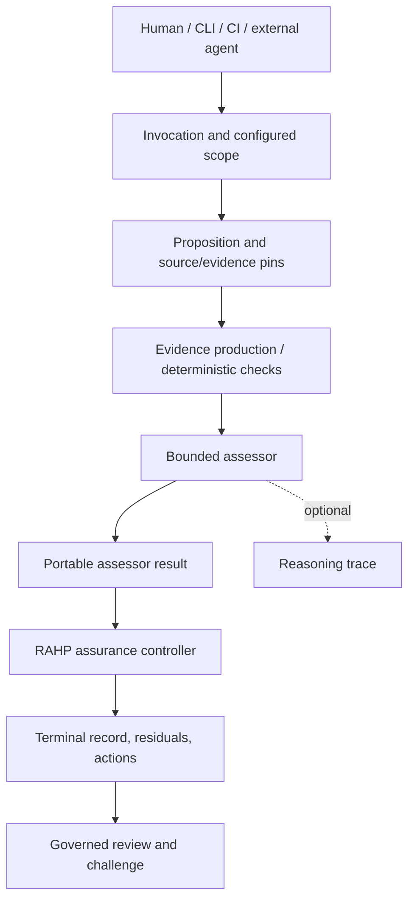

# RAHP reasoning architecture: independent and agent-orchestrated

**RAHP does not require an AI agent, LLM, or agent framework to perform a bounded assessment.** The same assessment capabilities may be invoked by a human, CLI, CI workflow, or external agentic system. The caller chooses when to invoke an assessment; it does not acquire the authority to redefine RAHP's evidence or assurance semantics.

## What “reasoning” means here

RAHP's method is a reviewable chain:

`persona/scenario → harm/risk → proposition → control/guardrail → evidence → inference → actionable recommendation`

This is **bounded evaluative reasoning**, not a general-purpose autonomous reasoning engine. Different stages can be implemented through deterministic validation, explicit rules, specialist judgment, and governed human review. A schema-valid response, successful test, persuasive narrative, or model-generated explanation is not automatically evidence of operational authority or an assurance PASS.

## Where it lives in the code

| Concern | Maintained implementation or contract | Authority boundary |
| --- | --- | --- |
| Source-pinned observation and reproducible checks | [Standalone TRQP replay](../examples/standalone-trqp/replay.py), [TRQP tests](../tests/test_standalone_trqp.py) | A replay supports only the propositions it actually checks |
| Bounded evidence-to-result evaluation | [Evidence assertion assessor](https://github.com/sankarshanmukhopadhyay/rahp-toolkit/blob/main/tools/evidence_assertion_assessor.py) | Configured evidence predicates, not arbitrary inference |
| Portable specialist return | [Assessor-result contract](assessor-result-contract.md), [schema](../schemas/rahp-assessor-result-v1.schema.json) | Contract validity is not substantive assurance |
| Optional structured explanation | [Reasoning trace](reasoning-trace.md), [validator](https://github.com/sankarshanmukhopadhyay/rahp-toolkit/blob/main/tools/reasoning_trace.py) | Structural consistency is not proof that an inference is correct |
| Assessment lifecycle and terminal reconciliation | [Assurance state machine](https://github.com/sankarshanmukhopadhyay/rahp-toolkit/blob/main/tools/assurance_fsm.py), [autonomous assurance controller](https://github.com/sankarshanmukhopadhyay/rahp-toolkit/blob/main/tools/autonomous_assurance_controller.py), [assessment controller](https://github.com/sankarshanmukhopadhyay/rahp-toolkit/blob/main/tools/assessment_controller.py) | Controller owns terminal assurance, not the invoking workflow |

There is **no single central reasoning function** that replaces all of these components. The responsibility is distributed intentionally. An assessor may produce a bounded result; a controller may reconcile that result; a reviewer may challenge or supersede it.

## Invocation is separate from assessment



The diagram describes **logical responsibilities**, not a claim that every deployment uses a single end-to-end API or always invokes all boxes. A standalone examination can stop at a documented finding; it must not be mislabeled a controller-issued terminal assurance decision.

## Three supported consumption patterns

1. **Standalone, without an agent:** Run the [TRQP source examination](../examples/standalone-trqp/README.md). Its source pins, replay and bounded findings are independently inspectable. No LLM or agent runtime is required.
2. **CI or deterministic orchestration:** Run the same bounded checks under a scheduled or change-triggered workflow. Successful job execution establishes process completion, not an automatic assurance PASS.
3. **External agent orchestration:** An agent can select a subject, propose scope, invoke an existing tool and summarize results. The agent's planning or narrative remains external to the RAHP contract; only the explicitly validated evidence and results can be submitted for assurance reconciliation. See [integration guidance](reasoning-integration.md).

## Worked TRQP example: observation is not authority

The retained TRQP API example contains a response whose requested time does not match the query's `context.time`. The replay checks the source-pinned example; the optional [F-002 reasoning trace](../examples/standalone-trqp/reasoning-trace-f002.json) records an observation of `NOT_SATISFIED` and an `INDETERMINATE` bounded judgment pending specification clarification. It does **not** establish runtime failure, revoked authority, or overall TRQP nonconformance.

Reproduce the check:

```bash
python3 examples/standalone-trqp/replay.py --check
python3 -m unittest tests.test_reasoning_trace tests.test_trqp_reasoning_trace tests.test_standalone_trqp -v
```

## Experimental evidence adequacy

The optional [evidence adequacy profile](evidence-adequacy.md) evaluates declared requirements and observations, including missing, conflicting and out-of-scope cases. It is not wired into controller terminalization and does not establish source authority.

## Experimental temporal applicability

The optional [temporal and provenance profile](temporal-provenance.md) distinguishes historical target time, knowledge cutoff, evaluation time, claimed effective intervals, and source pins. It does not determine source authority or historical truth and does not modify terminal assurance.

## Reproducibility and challenges

The optional [R3 reproducibility and challenge profile](reproducibility-challenge.md) compares declared input pins, evaluator versions and outcomes, while retaining unresolved challenges. It does not establish independent execution, source authenticity or authoritative adjudication.

A standalone [R1–R3 worked consumption example](reasoning-worked-example.md) demonstrates how the optional profiles can be invoked without promoting their results to terminal assurance.

## What remains outside this boundary

RAHP does not automatically confer delegation to an agent, authenticate an agent's principal, approve a policy exception, guarantee freshness of external evidence, or settle a contested substantive judgment. An optional reasoning trace is **not** a chain-of-thought transcript. [The trace profile](reasoning-trace.md) currently validates a bounded explanation only when explicitly invoked by a consumer.

For a first exercise, begin with the [adoption gateway](adoption-guide.md); for the wider lifecycle, see [How RAHP works](how-rahp-works.md).
