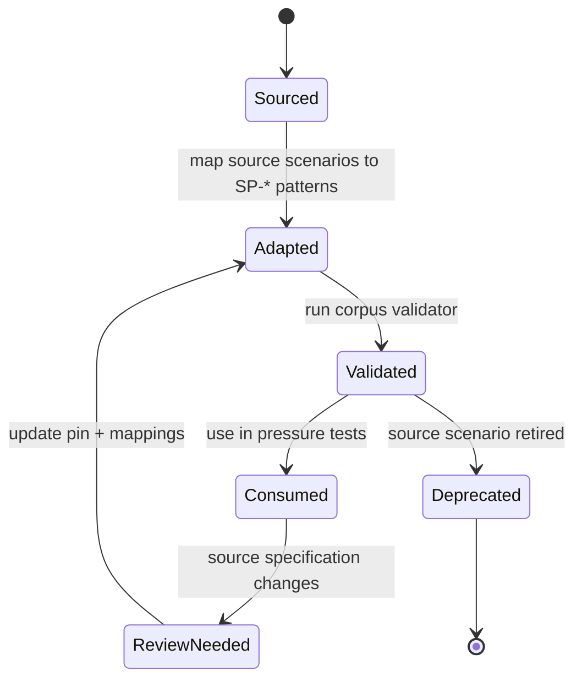

# Scenario corpora

Use the [Scenario corpora browser](../corpora/) for themed reader views of each packaged YAML corpus. Canonical `.yaml` URLs remain raw machine-readable sources; human projections use clean sibling routes such as `/corpora/trust-tasks/`.

Scenario corpora connect domain-specific use cases to portable RAHP pressure-test patterns. They are **adapters, not normative forks**: source projects retain authority over their scenario meaning and identifiers.

## Available corpora

| Corpus | Source | Purpose | Scenario count |
|---|---|---|---:|
| [DTG ZKP](../corpora/dtg-zkp/) | `sankarshanmukhopadhyay/dtgwg-zkp-tf` | ZKP implementation and governance stress cases | 30 |
| [Trust Tasks](../corpora/trust-tasks/) | `trustoverip/dtgwg-trust-tasks-tf` | Framework plus concrete task authorization, lifecycle, consent, redress, privacy and interoperability | 30 |
| [DTG Credential Spec](../corpora/credential-spec/) | `trustoverip/dtgwg-cred-spec` | Credential lifecycle, relationship semantics, privacy, authority, task context and evidence closure | 30 |
| [Trust Tasks × CredSpec](../corpora/trust-tasks-credspec-composed/) | RAHP-authored DTG profile adapter | Emergent failure modes at the task/credential seam | 20 |
| VDS interface baseline | `trustoverip/dtgwg-vds-tf` | Scenario-baseline probes while normative VDS text remains thin | 4 |
| Agent Names interface baseline | `trustoverip/dtgwg-agent-names-tf` | Scenario-baseline probes separating naming, control and authority | 4 |
| CredSpec × ZKP | RAHP-authored DTG profile adapter | Proof semantics, lifecycle, authority and privacy composition | 4 |
| CredSpec × VDS | RAHP-authored DTG profile adapter | Persistent state, lifecycle, authority and provenance | 4 |
| Trust Tasks × ZKP | RAHP-authored DTG profile adapter | Proof-versus-authority, delegation, replay and freshness | 4 |
| Trust Tasks × VDS | RAHP-authored DTG profile adapter | Persistent relationship state versus current task authority | 4 |
| ZKP × VDS | RAHP-authored DTG profile adapter | Linkability, selective disclosure, lifecycle and provenance | 4 |
| Agent Names × Trust Tasks | RAHP-authored DTG profile adapter | Naming versus principal/delegate/task authority | 4 |
| Agent Names × CredSpec | RAHP-authored DTG profile adapter | Identifier, subject/controller and issuer-authority semantics | 4 |
| [CAWG/C2PA](../corpora/cawg/) | Multi-source external CAWG/C2PA portfolio | Identity, governance, consent, delegation, metadata, privacy, UX, security and mandate-readiness interactions | 36 |

Together these adapters expose **182 scenario test vectors** to the RAHP pressure-testing workflow. The CAWG/C2PA corpus is intentionally multi-source: its primary source and additional specification repositories are declared without inventing a DTG Portfolio Monitor relationship.

## Source-pinned Trust Tasks and Credential Spec baselines

The Trust Tasks and Credential Spec adapters were re-baselined on 2026-08-23 against immutable reviewed revisions:

- Trust Tasks: `trustoverip/dtgwg-trust-tasks-tf@4937c70df95e56ed6404b8c004106ecb121a23cf`
- Credential Spec: `trustoverip/dtgwg-cred-spec@b89f389abbdae77ba60b673c0836c781c2b54169`

Their previous `archive-snapshot` provenance is no longer used. The composed Trust Tasks × CredSpec corpus is derived from those two pinned adapters and must be recomposed whenever either dependency is semantically re-baselined.

## Coverage rather than scenario-count inflation

The primary corpora now carry a machine-readable `coverage` map. Scenario growth is justified by a missing pressure dimension, not by a target count.

| Coverage dimension | Trust Tasks | Credential Spec | TT × CredSpec |
|---|---:|---:|---:|
| Identity / authority | strong | strong | strong |
| Lifecycle / current state | strong | strong | strong |
| Replay / freshness | strong | moderate | strong |
| Privacy / correlation | strong | strong | strong |
| Delegation / constrained authority | moderate | strong | strong |
| Approval / threshold | strong | contextual | strong |
| Suspension / restoration | partial | strong | strong |
| Redress / adverse decisions | strong | governance-dependent | strong |
| Evidence closure | moderate | strong | strong |
| Interoperability / versioning | strong | strong | strong |

The map is deliberately descriptive rather than a score. A `strong` label means the corpus contains multiple distinct pressure cases; it does **not** mean the target specification is assured.

## What changed in the Trust Tasks corpus

The original 16 vectors remain. The expanded source-pinned set adds pressure around:

- grant authority versus authenticated grant evidence;
- ACL scope reduction, role change, expiry and revocation propagation;
- empty-versus-absent least-privilege semantics such as `allowedKeys`;
- consent decision challenge binding and replay;
- stale approver authority and approver-set races;
- undefined N-of-M, joint or sequential threshold composition;
- durable, portable evidence for member-removal redress;
- post-removal notice reachability;
- audit-store correlation risk; and
- authoritative post-state interpretation.

These cases are grounded in current framework text and concrete task specifications rather than inferred from the old monolithic `SPEC.md` snapshot alone.

## What changed in the Credential Spec corpus

The original 16 vectors remain. The expanded source-pinned set adds pressure around:

- VWC digest interpretation when the referenced VRC is unavailable;
- integrity binding versus confidentiality of deterministic digests;
- current issuer authorization independent of validity periods;
- historical versus current trust-registry state;
- supersession, suspension, expiry and restoration semantics;
- representative authority without incapacity or rights-waiver inference;
- appointment evidence versus transaction permission;
- status-service observation and composed correlation;
- issuer/subject role binding;
- governance-local assurance portability; and
- complete evidence closure versus credential-by-credential validity.

## Cross-spec composed corpora

Some consequential failures are not owned by either specification alone. The Trust Tasks × CredSpec adapter now also tests:

- ACL authority changing while credential evidence remains valid;
- approval remaining valid after supporting credential authority changes;
- quorum evidence composed across different transaction or credential-state versions;
- member-removal evidence conflicting with a still-valid VMC;
- VWC digest use without the referenced VRC needed to identify the edge;
- status lookup plus task metadata creating a durable correlator;
- restoration propagating through only one layer; and
- technically valid task/credential evidence being over-read as fiduciary or constrained-action propriety.

`XSP-*` identifiers are RAHP-owned because these are synthesized interaction scenarios rather than copied source use cases.

## Why separate corpora from patterns?

A source scenario such as `TT-023` or `CS-026` describes a concrete domain condition. A portable `SP-*` pattern describes the reusable failure class. This separation lets RAHP ask the same harms question across specifications without taking ownership of another project's identifiers.

**Evidence grades matter.** Mature, pinned source material can support `source-pinned` or `source-informed` assessments. Thin or pre-normative upstream repositories are represented as `scenario-baseline`: the seam is runnable, but resulting findings remain assurance hypotheses for maintainer disposition rather than normative conformance claims.

## Corpus lifecycle

The adapter version and source pin make that lifecycle visible without transferring ownership of source identifiers into RAHP. See [Corpus synchronization and provenance](corpus-synchronization.md) for automated drift detection and review rules.

## Adding or expanding a corpus

1. Keep source-owned identifiers and normative meaning with the source project.
2. Add or update the YAML adapter under `corpora/`.
3. Register the adapter in `corpora/sources.yaml`, including its tracked repository/path.
4. Record an immutable reviewed source commit and adapter version; never advance a source pin merely because upstream HEAD changed.
5. Give every scenario a domain, goal, pressure, priority and at least one `SP-*` mapping.
6. Prefer a `source_anchor` that tells a reviewer exactly where the scenario was derived.
7. Maintain the corpus `coverage` map so missing dimensions remain visible.
8. Run `python3 tools/validate_scenario_corpora.py` and `python3 tools/corpus_status.py --offline`.
9. Recompose derived corpora when a dependency is re-baselined.
10. Re-run affected reviews when source semantics or scenario coverage materially change.

{: .warning }
A corpus broadens review coverage; it does not establish that the target specification is safe or conformant.
